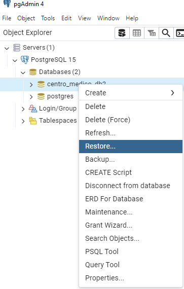
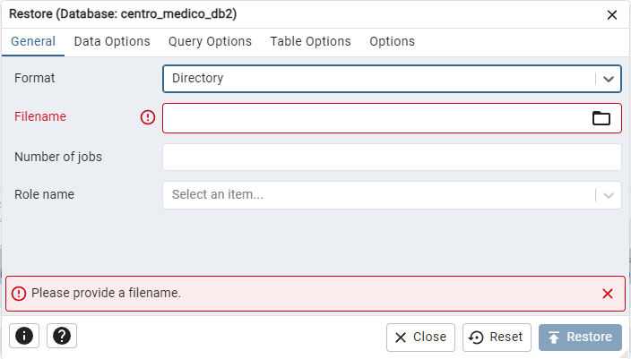
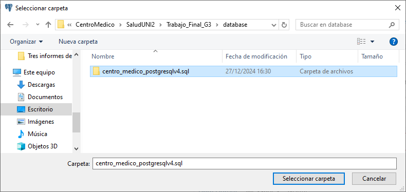

# Sistema Centro Médico SaludUNI

## Descripción

El siguiente proyecto tiene como finalidad el poder reservar citas médicas y realizar consultas de medicamentos

## Pasos para instalar y ejecutar el proyecto

### 1. Descargar Node.js

Dirígete al sitio web oficial de Node.js para descargar la última versión LTS (Long Term Support):

- [Página de descarga de Node.js](https://nodejs.org/)

### 2. Instalar Node.js

- **Windows/Mac**: Descarga el instalador correspondiente a tu sistema operativo y sigue las instrucciones del asistente de instalación.
- **Linux**:
  - Abre una terminal y usa el siguiente comando para instalar Node.js y npm (el gestor de paquetes de Node.js):
  
  **Ubuntu/Debian:**
  ```bash
  sudo apt update
  sudo apt install nodejs npm

### 3. Verificar Node.js

Una vez instalado ejecutar

```bash
node -v
npm -v
```

### 4. Instalar PostgreSQL

Dirígete al sitio web oficial de PostgreSQL para descargar la versión 15.10
- [Página de descarga de PostgreSQL](https://www.postgresql.org/download/windows/)

Sigue los pasos de instalación y creación de password Superuser.

### 5. Crear Base de Datos e Importar

Una vez iniciado la aplicación pgAdmin4 creamos la base de datos


Posterior colocamos el siguiente nombre a nuestra base de datos


Luego de eso en la base de datos creada iniciamos la importación de la base de datos del proyecto


Seleccionamos la opción Directory


Finalmente vamos a la carpeta del proyecto y en database escogemos la siguiente base de datos


Por último podemos visualizar el contenido de la base de datos
